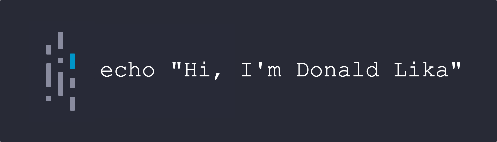

# Hey there👋, Welcome to my Github Profile

## ⚡🙋‍♂️ About Me

 

💡 &nbsp;I enjoy exploring new technologies, develop software solutions and quick hacks.\
💻 &nbsp; I’m currently working at [Smartrecruiters](https://www.epsilon.com/us) \
🎓 &nbsp;I graduated on M.S.c Computer Science at the University of Tirana.\
🌱 &nbsp;I continuous keep learning about Systems Design, and Cloud Architecture, Distributed systems. \
📚 &nbsp;In my free time, I like to read about history, self-improvement techniques, soft skills.

 

## 🛠 Tech Stack

&nbsp;
&nbsp;
&nbsp;
&nbsp;
&nbsp;
&nbsp;\

&nbsp;
&nbsp;
&nbsp;

&nbsp;
&nbsp;
&nbsp;
